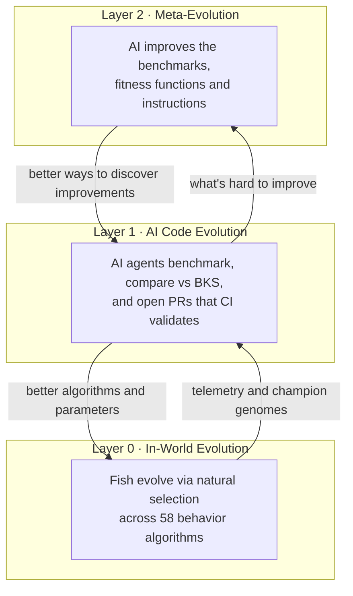
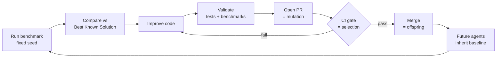

# Tank World

**Self-evolving artificial life where Git is the genome.**

[](https://github.com/mbolaris/tank/actions/workflows/ci.yml)
[](https://github.com/mbolaris/tank/actions/workflows/bench.yml)
[](https://www.python.org/downloads/)
[](LICENSE)
[](https://github.com/psf/black)

Tank World is an open-source research framework where AI agents autonomously conduct artificial life experiments and commit their improvements back to the codebase. A simulation runs, an AI analyzes the telemetry, improves the underlying algorithms, and opens a pull request. CI re-runs the benchmarks to validate the claim. If it passes, the change merges and becomes the new baseline for the next cycle.

The result: a continuously improving evolutionary system where **PRs are mutations, CI is natural selection, and Git history is the phylogenetic tree**. This is not a metaphor — it is the literal mechanism by which the project develops.

> **[Full Vision](docs/VISION.md)** | **[Architecture](docs/ARCHITECTURE.md)** | **[Agent Guide](AGENTS.md)** | **[Roadmap](docs/ROADMAP.md)** | **[Evolvability](docs/EVOLVABILITY.md)**

---

## Why This Matters

Most AI-assisted development treats the AI as a tool that responds to human requests. Tank World inverts this: the AI is the primary researcher, running experiments continuously, and the human reviews the results. The framework is designed so that:

- **AI agents discover improvements** by analyzing simulation data and proposing code changes
- **Benchmarks enforce rigor** with deterministic seeds and independently reproducible results
- **CI gates prevent regressions** automatically before any merge
- **Every merged PR raises the floor** for the next agent session

This creates compounding returns. Each improvement is inherited by future agents who build on top of it. Over time, the system gets better at getting better.

The goal is not a comfortable fish tank. It is **evolvability**: a system that keeps producing meaningful adaptive novelty — sustained selection pressure, diversity preservation, niche formation, open-endedness. A change that makes every fish survive flattens the selection gradient and counts as a regression, even if the tank looks healthier. [docs/EVOLVABILITY.md](docs/EVOLVABILITY.md) maps these levers to code and records which ideas have already been tried and buried.

---

## Three-Layer Evolution

Tank World is not "a sim with evolution." It is an **evolution engine whose own development process is part of the evolutionary loop**.



### Layer 0: In-World Evolution

Fish compete for survival using 58 parametrizable behavior algorithms encoded in their genomes. Natural selection tunes parameters and shifts algorithm prevalence over generations. Better strategies mean more reproduction and longer survival.

**Output**: Champion genomes, performance telemetry, population dynamics data.

### Layer 1: AI-Driven Code Evolution

AI agents run deterministic benchmarks, compare results against the Best Known Solutions registry, and propose improvements via pull requests. CI validates the improvement before merge.

**Output**: Better algorithms, tuned parameters, new behavior strategies.

### Layer 2: Meta-Evolution

AI agents improve the benchmarks, fitness functions, agent instructions, and CI workflows that Layer 1 uses. This is evolution of the evolutionary process itself — and it is already running: the agent workflows in this repo (validation gates, decision-board prompts, field guides) were largely written and refined by agents.

**Output**: Better ways of discovering improvements.

**The loop**:



---

## What You See

A fish tank ecosystem with real evolutionary dynamics:

- **58 behavior algorithms** across food seeking, predator avoidance, schooling, energy management, territory, and poker strategies
- **Predator-prey dynamics** with crabs hunting fish
- **Fractal L-system plants** with genetic evolution and nectar production
- **Fish poker** where fish play Texas Hold'em against each other and plants for energy stakes, on a full poker engine
- **Fish soccer** as a skill minigame with its own training benchmarks and tournaments
- **Day/night cycles** affecting behavior and visibility
- **Genetic inheritance** of physical traits, visual traits, behavior algorithms, and mate preferences
- **Multiple worlds**: the same agents, genetics, and energy model render as a fish tank or a Petri dish of microbes
- **Real-time web UI** built with React 19 + FastAPI + WebSocket, rendering at 30 FPS

The visualization is deliberately engaging. Entertainment drives participation: if people enjoy watching their tank, they'll run longer experiments and contribute more compute.

### Watch the Watchers: Live Sim Observability

The UI has an **Insights feed** where AI agents post commentary on the evolutionary dynamics as they unfold — an early, working version of the planned "AI oceanographer" narration layer:

```bash
# Structured evolution-health report on a running sim (read-only)
python tools/evolution_report.py --url http://127.0.0.1:8000 --json

# Post an observation to the UI's Insights feed
python tools/post_commentary.py --url http://127.0.0.1:8000 \
    --text "Selection on pursuit_aggression: +12% over 40k frames" \
    --severity insight --tags selection

# Read the feed back
python tools/post_commentary.py --read --limit 15
```

The `/observe-sim` and `/study-sim` agent skills drive these tools automatically.

---

## Quick Start

### Prerequisites

- Python 3.10+
- Node 20+ (matches the frontend CI environment)

### Install

```bash
# Clone
git clone https://github.com/mbolaris/tank.git
cd tank

# Python setup
python3 -m venv .venv
source .venv/bin/activate  # Linux/Mac
# .\.venv\Scripts\Activate.ps1  # Windows PowerShell
pip install -e .[dev]
pre-commit install

# Frontend setup
cd frontend && npm ci && cd ..
```

### Run the Web UI

Launch both the FastAPI backend and the Vite React frontend with a single command:

```bash
python start.py
```

This runs pre-flight checks, installs frontend dependencies if missing, starts both servers in parallel with colored log output, opens http://localhost:3000 in your browser, and shuts everything down cleanly on `Ctrl+C`.

*(Alternatively, run them in separate terminals: `python main.py` from the root for the backend, and `cd frontend && npm run dev` for the frontend.)*

### Run Headless (10-300x Faster)

```bash
# Quick test
python main.py --headless --max-frames 5000 --seed 42

# Full experiment with stats export
python main.py --headless --max-frames 30000 --stats-interval 10000 --export-stats results.json --seed 42

# Record a deterministic replay
python main.py --headless --max-frames 500 --seed 42 --record out.replay.jsonl

# Replay and verify fingerprints
python main.py --headless --replay out.replay.jsonl

# Run a benchmark and save the result
python tools/run_bench.py benchmarks/tank/survival_5k.py --seed 42 --out results.json
```

### Run the Demo

```bash
# One command: short tank sim + replay + soccer episode + benchmark bundle
python tools/demo.py --seed 42
```

That creates `runs/demo_<timestamp>/` with a `manifest.json` (seed, parameters, git metadata, headline scores), a step-level `demo.log`, a human-readable `summary.md`, plus `tank_results.json`, `tank.replay.jsonl`, `soccer_episode.json`, and `benchmark_result.json`.

See [SETUP.md](SETUP.md) for detailed setup and troubleshooting.

---

## The Evolution Loop

This is the core workflow that makes Tank World self-improving:

```
1. RUN benchmark with a deterministic seed
2. COMPARE results against the Best Known Solutions registry
3. IMPROVE code based on data analysis
4. VALIDATE with tests and benchmarks
5. OPEN PR with reproducible evidence
6. CI CONFIRMS the improvement
7. MERGE raises the baseline for all future agents
8. REPEAT
```

### Best Known Solutions (BKS) Registry

The repository maintains a formal registry of champion solutions:

```
benchmarks/          # Deterministic, reproducible evaluation harnesses
  tank/              # survival_5k, ecosystem_health_10k, selection_response_10k
  soccer/            # training_3k, training_5k
champions/           # Best-known solution snapshots per benchmark
  tank/              # Current tank champions
  soccer/            # Current soccer champions
```

Champion files are benchmark result snapshots: they store the benchmark id, seed, score, metadata payload, and timestamp; when updated through the validation tooling they can also keep a nested `champion` record plus history. Anyone can verify a claimed result by re-running the benchmark and comparing the score and metadata.

The tank suite is intentionally more than a survival timer. `ecosystem_health_10k` rewards generation turnover, while `selection_response_10k` is a frozen assay that measures directional heritable trait response — catching the failure mode where a population churns generations fast but its traits stay flat or collapse. Optimizing for survival alone will not win it.

### Evolutionary PR Protocol

When you discover an improvement (human or AI):

1. Run the benchmark: `python tools/run_bench.py benchmarks/tank/survival_5k.py --seed 42 --out results.json`
2. Compare vs champion: `python tools/validate_improvement.py results.json champions/tank/survival_5k.json`
3. If better, report the command, seed, score, metadata, and code diff in the PR.
4. Do not edit `champions/**/*.json` or use champion-update tooling unless a maintainer or task prompt explicitly authorizes that scope.
5. Open a PR with benchmark evidence; CI re-runs the relevant checks before merge.

See [docs/EVO_CONTRIBUTING.md](docs/EVO_CONTRIBUTING.md) for the complete protocol.

---

## AI-Driven Development

Tank World is built for AI-first development, and several agent workflows are wired directly into the repo.

### Multi-Model Deliberation Board

Rather than a single agent guessing at the next improvement, Tank World runs a **decision board** where multiple AI models (for example Claude, GPT, and Gemini) propose, debate, and vote on the next evolvability experiment — then a builder agent turns the elected proposal into the smallest reproducible, validated PR.

```bash
# Join the board: propose, sharpen, and vote on the next evolvability change
/deliberate

# Build the elected proposal as a minimal, validated PR
/build-elected
```

Every proposal must be **bold in ambition, rigorous in evidence, minimal in the first experiment** — a plausible new evolutionary dynamic, a small testable first experiment, and a falsifiable metric that would prove or kill the idea.

### Autonomous Code-Evolution Agent

```bash
# 1. Run a simulation and export data
python main.py --headless --max-frames 30000 --export-stats results.json --seed 42

# 2. Install optional AI provider dependencies
pip install -e .[ai]

# 3. AI agent analyzes results, identifies underperformers, and improves code
python scripts/ai_code_evolution_agent.py results.json --provider anthropic --validate

# 4. Run an AI tournament to evaluate poker strategies
python scripts/run_ai_tournament.py --write-back
```

The code-evolution agent supports the `anthropic` and `openai` providers and expects the matching API key in `ANTHROPIC_API_KEY` or `OPENAI_API_KEY`. It reads simulation data, identifies the worst-performing algorithms, reads their source, implements improvements, validates with benchmarks, and creates a Git branch. See [AGENTS.md](AGENTS.md) for the complete agent guide.

### Getting Started as an Agent

The repository ships infrastructure for productive agentic sessions:

- **[CLAUDE.md](CLAUDE.md)** — project intelligence, loaded automatically by Claude Code
- **[AGENTS.md](AGENTS.md)** — comprehensive guide for agents entering the evolution loop
- **[docs/AGENT_FIELD_GUIDE.md](docs/AGENT_FIELD_GUIDE.md)** — decision tree, difficulty-rated starter tasks, and copy-paste recipes for agents of any capability
- Deterministic benchmarks, pre-commit hooks, and layered CI gates that catch regressions early

```bash
pip install -e .[dev] && pre-commit install
python tools/smoke_gate.py     # before coding (<30s)
python tools/agent_gate.py     # before a local commit (<90s)
python tools/pre_pr_gate.py    # before opening a PR (broad non-slow suite)
```

---

## Project Structure

```
tank/
|-- main.py                  # CLI entry point (web or headless)
|-- backend/                 # FastAPI + WebSocket server
|-- core/                    # Pure Python simulation engine (no UI deps)
|   |-- algorithms/          # 58 behavior algorithms (composable library)
|   |-- worlds/              # Tank/Petri backends and shared world abstractions
|   |-- modes/               # Game rulesets (energy models, scoring)
|   |-- minigames/           # Soccer training and league runtime
|   |-- agents/components/   # Reusable agent building blocks
|   |-- entities/            # Fish, Plant, Crab, Food, PlantNectar
|   |-- poker/               # Full poker engine with evolving strategies
|   |-- genetics/            # Genome, traits, inheritance
|   |-- simulation/          # Engine orchestration
|   `-- config/              # Tunable parameters
|-- frontend/                # React 19 + TypeScript + Vite
|-- tests/                   # ~200 test files, ~2,000 tests (smoke, core, integration)
|-- benchmarks/              # Deterministic evaluation harnesses
|-- champions/               # Best Known Solutions registry
|-- scripts/                 # AI evolution agent, tournaments, automation
`-- tools/                   # Benchmark runner, validation, dev utilities
```

**Key design decisions**:
- **Protocol-based design** with dependency injection for testability
- **Phase-based execution** for deterministic, reproducible simulation
- **Component composition** for reusable agent building blocks
- **Multi-world backend** enabling different world types (Tank, Petri, Soccer)
- **Interpretable algorithms** over black-box neural networks (behaviors are debuggable)

See [docs/ARCHITECTURE.md](docs/ARCHITECTURE.md) for the full technical deep-dive and [docs/adr/](docs/adr/) for architecture decision records.

---

## Testing & Code Quality

```bash
# Smoke gate (under 30 seconds)
python tools/smoke_gate.py

# Agent gate (under 90 seconds, smoke gate + curated checks)
python tools/agent_gate.py

# Pre-PR gate (broad non-slow suite; runtime varies by hardware)
python tools/pre_pr_gate.py

# Full validation gate (nightly/maintainers only)
python tools/full_gate.py

# Type-check core strictly
python -m mypy core/

# Pre-commit (runs all checks)
pre-commit run --all-files

# Benchmark determinism verification
python tools/run_bench.py benchmarks/tank/survival_5k.py --seed 42 --verify-determinism
```

CI currently runs `smoke-gate`, `pre-pr-gate`, `frontend-ci`, `security-audit`, and `nightly-full` under [`.github/workflows/ci.yml`](.github/workflows/ci.yml), with `verify-champions` and `benchmark-gate` defined separately in [`.github/workflows/bench.yml`](.github/workflows/bench.yml).

---

## Ecosystem Dynamics

### What Evolves

| Domain | Mechanism | Example |
|--------|-----------|---------|
| Algorithm parameters | In-world natural selection | `GreedyFoodSeeker` tunes detection radius over generations |
| Algorithm prevalence | Differential reproduction | `AmbushFeeder` outcompetes `PanicFlee` in low-predator environments |
| Physical traits | Genetic inheritance + mutation | Speed, size, vision range, metabolism |
| Poker strategies | Energy-stakes selection | Aggressive bluffers vs conservative folders |
| Visual traits | Mate-preference evolution | Color patterns, fin sizes, body shapes |
| Code itself | AI-driven PR cycle | Agent improves `MirrorMover` with a food-seeking fallback |

### Energy Flow

```
Environment -> Fractal Plants -> Nectar -> Fish -> Predators (Crabs)
                                   |
                              Poker Games (energy redistribution)
```

Reproduction is funded by *overflow* energy: fish bank energy earned above their max and spend it on offspring. This is why the healthy ecosystem is a balancing act — burning a well-fed fish's surplus on ball play or poker directly suppresses birth rate and generation turnover, which the health benchmarks penalize.

---

## Project Status & Roadmap

**Current focus**: expanding the benchmark/champion workflow, keeping deterministic validation healthy, and hardening the multi-world architecture.

| Phase | Goal | Status |
|-------|------|--------|
| 0 | Foundation (58 algorithms, headless mode, web UI, basic AI evolution) | Complete |
| 1 | Evolution Loop MVP (BKS registry, evolutionary PRs, CI validation) | In Progress |
| 2 | Closed-loop automation (continuous AI improvement cycles) | Planned |
| 3 | Meta-evolution (AI improves its own instructions and benchmarks) | In Progress |
| 4 | Research platform (publishable ALife findings) | Planned |
| 5 | Distributed compute (entertainment-driven participation) | Planned |
| 6 | Evolving visualization (AI evolves how research is presented) | Planned |

See [docs/ROADMAP.md](docs/ROADMAP.md) for detailed milestones.

---

## Contributing

Tank World welcomes contributions from humans and AI agents:

- **Run simulations** and share performance data
- **Improve algorithms** in `core/algorithms/` and validate with benchmarks
- **Review AI-proposed changes** to maintain quality
- **Extend the benchmark suite** with new evaluation harnesses
- **Improve the framework** (visualization, tooling, documentation)

See [docs/EVO_CONTRIBUTING.md](docs/EVO_CONTRIBUTING.md) for the evolutionary PR protocol.

---

## Documentation

| Document | Purpose |
|----------|---------|
| [CLAUDE.md](CLAUDE.md) | Claude Code project intelligence (auto-loaded) |
| [AGENTS.md](AGENTS.md) | AI agent guide for entering the evolution loop |
| [docs/AGENT_FIELD_GUIDE.md](docs/AGENT_FIELD_GUIDE.md) | Recipe-driven starter-task menu for agents of any capability |
| [SETUP.md](SETUP.md) | Development environment setup |
| [docs/VISION.md](docs/VISION.md) | Long-term vision and three-layer evolution paradigm |
| [docs/EVOLVABILITY.md](docs/EVOLVABILITY.md) | Evolvability levers mapped to code, plus the ideas graveyard |
| [docs/ROADMAP.md](docs/ROADMAP.md) | Development roadmap and milestones |
| [docs/ARCHITECTURE.md](docs/ARCHITECTURE.md) | Technical architecture deep-dive |
| [docs/EVO_CONTRIBUTING.md](docs/EVO_CONTRIBUTING.md) | Evolutionary PR protocol |
| [docs/BEHAVIOR_DEVELOPMENT_GUIDE.md](docs/BEHAVIOR_DEVELOPMENT_GUIDE.md) | Creating new behavior algorithms |
| [docs/INDEX.md](docs/INDEX.md) | Complete documentation index |

---

## Credits

Built with Python, React, TypeScript, FastAPI, NumPy, and a deep appreciation for Conway's Life, Tierra, Avida, and the ALife research tradition.

## License

Open source under the [MIT License](LICENSE).

---

*The fish tank is just the surface. Underneath it, Git is evolving.*
