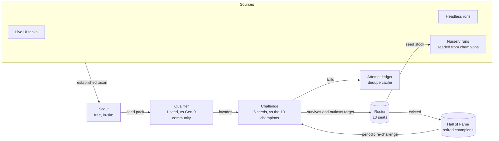

# Champions Tank — a standing arena for the best of the best

> **Status:** Proposed design (2026-09-24). Nothing here is built yet. §13 lists
> the delivery plan one PR at a time, starting with a noise study (A0) that fixes
> the numbers this document only estimates.
>
> **Layer:** Layer 2. This adds a new ruler and a new heredity channel. Keep it
> in separate PRs from Layer 1 algorithm changes, per `CLAUDE.md`.

## 0. The idea

Keep a **standing roster of 10 champion species**. Each is a small founding group
of genomes captured from a species that did well in some earlier tank run. When
a new species looks strong enough, **drop a copy of it into a tank that already
holds the 10 champions**. If it survives and outlasts the weakest champion, it
takes that champion's seat. The champion it displaces is retired to a Hall of
Fame, not deleted.

Then close the loop: **start new evolution runs from champion stock** instead of
from random genomes. The best fish ever found then become the starting point for
the next search, not a number in a JSON file.

In one line: *git already carries our code across generations; the champions
tank makes it carry our fish too.*

---

## 1. Why: what is actually stalling

These three points come from the code and from the current champion files.
Read them before judging what this design can and cannot fix.

1. **Every run starts from zero and then throws its fish away.** Each benchmark
   builds its first population with `Genome.random()` (`core/entity_factory.py`),
   runs 5k–10k frames, and discards everything. The current `survival_5k`
   champion reaches `max_generation` **4**. A 3,000-frame run of the same world
   reaches generation 2 (measured for this doc, about 10 ms per frame with 60
   fish). No run ever builds on a previous run. Open-ended evolution needs
   hundreds of generations, and we cap every experiment at single digits and
   then restart.
2. **The Layer 1 loop evolves code, not fish.** Benchmarks score the *engine*
   starting from random genomes; the only heredity that lasts is the code. An
   excellent species found in a long live-UI session leaves no trace anywhere.
3. **Inside one tank, a better forager is barely rewarded.** The food thermostat
   holds total fish energy in a narrow band and `max_population` pins the count,
   so per-fish energy is set by the config, not by behavior (CLAUDE.md, "Food
   supply is a thermostat").

What the champions tank changes:

- It fixes (1) and (2) directly. Evolution becomes **cumulative across runs**,
  and the unit that survives is a genome, not just a commit.
- It turns (3) into the measurement itself. In an arena of **reproductively
  isolated houses**, the thermostat is still a shared tap. A house that forages,
  survives, or reproduces better takes *population share away from the other
  houses*. Relative fitness between lineages is exactly what the arena reads out.

What it does **not** do: make evolution inside a single run faster. Engine speed
is still Theme 13 in [IMPROVEMENT_PROPOSALS.md](IMPROVEMENT_PROPOSALS.md). The
champions tank is the reason that speed matters: every frame saved buys more
challenges and more nursery runs (§11).

---

## 2. The loop



Four stages, each cheaper than the next, so expensive arena time goes only to
candidates that already look good.

---

## 3. Vocabulary

| Term | Meaning |
|---|---|
| **House** | One champion species inside the arena. Its members carry a house tag and breed only with each other. |
| **Seed pack** | The genomes a house starts with: **5 genomes** taken from one established taxon at capture time. This is the stored champion. |
| **Roster** | The 10 seated houses. One JSON file in git. |
| **Challenger** | A seed pack trying to take a seat. |
| **Match** | One deterministic arena run on one seed. |
| **Challenge** | The same match on the fixed arena seed set (default 5 seeds), plus the verdict. |
| **Hall of Fame** | Retired champions, with their full records. They can challenge again. |
| **Gen-0 community** | A frozen population of 50 `Genome.random` fish from a fixed seed. It is the absolute yardstick (§9). |

---

## 4. What a champion is

**The unit is a species, not a single fish.** A single genome is fragile: one fish
can die of bad luck before it breeds, and it carries none of the variation that
made its species successful. A seed pack of 5 genomes from one established
taxon captures the species as a small gene pool. The houses are still
attributable, because recombination happens only inside a house.

**Choosing the 5 genomes:** the taxon's current medoid, plus 4 living members
picked by farthest-point sampling on the taxonomy profile distance. That keeps
the pack's variation without keeping near-duplicates.

**Eligibility** reuses the taxonomy lifecycle ([TAXONOMY.md](TAXONOMY.md)). A
candidate must come from an **established** taxon, meaning at least 5 living
members, at least 8 successful births, and at least 3 generations of
persistence (`core/taxonomy/registry.py`). "Looks successful" gets a definition
we already maintain instead of a new one.

**Storage:** `champions/arena/roster.json`, with genomes stored through
`Genome.to_dict()`, which is schema-versioned (`GENOME_SCHEMA_VERSION = 5`,
`core/genetics/genome_codec.py`).

```jsonc
{
  "arena_id": "tank/champions_arena",
  "arena_version": 1,
  "config_hash": "…",                  // hash of ARENA_CONFIG, as champions do today
  "seats": [
    {
      "seat": 3,
      "house_id": "house_0007",
      "name": { "common": "Banded Drifter", "scientific": "Velox vagans" },  // from taxonomy
      "seed_pack": [ { /* Genome.to_dict() */ }, … ×5 ],
      "provenance": {
        "source": "nursery",           // live | headless | nursery
        "run_seed": 1311, "commit": "ad2c3c8", "frame": 28000,
        "taxon_id": "taxon_12", "generation_range": [9, 14]
      },
      "admitted": {
        "commit": "…", "challenge_id": "…", "evicted": "house_0003",
        "settled_share": { "mean": 0.121, "per_seed": [ … ] }
      },
      "record": { "challenges_faced": 7, "survived": 7, "admitted_at": "2026-10-02" }
    }
  ]
}
```

Retired champions go to `champions/arena/retired/<house_id>.json` with the same
record plus the reason they left. Every rejected challenge goes to the existing
attempt ledger (`core/research/attempt_ledger.py`), not to git.

**Loading is strict.** Follow the import rules in
[FEDERATION.md](FEDERATION.md): unknown enum names, unknown parameter keys, or
non-finite values are rejected, never coerced. A champion whose genome no longer
loads after an engine change is **fossilized**: moved to the Hall of Fame with
that reason. The seed-pack loader is the natural first consumer of the planned
genome wire format v1.

---

## 5. The arena

### 5.1 World

Start from the `survival_5k` world (`benchmarks/tank/survival_5k.py::WORLD_CONFIG`:
2000×2000, `max_population` 60, plants off, soccer league off, food rate 9).
That world's regulation has already been measured: rate 9 is inside the band
the thermostat can hold (CLAUDE.md). Pin it as `ARENA_CONFIG` with its own
`config_hash`, the way champions are pinned today.

The arena then needs three rule changes:

| Change | Why | Mechanism |
|---|---|---|
| **Houses are reproductively isolated** | Makes outcomes attributable. A hybrid of houses 3 and 7 belongs to neither. | Found each house with `Fish(species="house_0007")`. `species` is already inherited by asexual and sexual offspring (`asexual_factory.py`, `sexual_factory.py`), and every mating path already requires `mate.species == parent.species` (`sexual_factory._find_proximity_mate`, `reproduction_mixin`, post-poker `is_valid_reproduction_mate`). **No new isolation code is needed.** Poker between houses still happens, as an energy channel between them. |
| **Mutation off** | The arena measures the champion as captured, not what it might mutate into. Recombination *inside* a house still mixes the 5 pack genomes. | New world-config flag `mutation_enabled` (default `True`) that makes offspring exact recombinants. |
| **Emergency spawning off** | `ReproductionService._spawn_emergency_fish` clones a *genetically unique* parent (`_select_diverse_parent`). It also fires at low probability whenever the tank is below cap, not only in a crisis. In an arena that would **resurrect whichever house is dying** and hand the challenger free fish. | New world-config flag `emergency_spawning_enabled` (default `True`). |

Both new flags go in the **world-config dict**, not as module constants. Adding
constants to a module listed in `SIM_CONFIG_MODULES` changes the `config_hash`
of every existing champion at once ([SKILL_PROGRESSION.md](SKILL_PROGRESSION.md),
design rule 5). With the defaults, existing benchmarks must stay bit-identical;
check that with `tools/perf_check.py`.

### 5.2 Match timeline (one seed)

```
frame 0          3,000                                   12,000
  │  burn-in      │  challenge phase                        │
  │  10 houses ×  │  challenger's 5 founders dropped in     │
  │  5 founders   │  at random positions (seeded)           │
  │  = 50 fish    │                    ├── settle window ───┤
  │  (cap 60)     │                    9,000 → 12,000       │
```

- **Burn-in (3,000 frames).** The resident community grows to the cap and
  settles. The challenger then arrives **rare**, into an established community,
  which is the "a copy is added to the tank" test. In ecology this is the
  invasion-fitness test: can a rare type increase when it is introduced into a
  resident population at equilibrium?
- **Challenge phase (9,000 frames).** A fish lives at most `1,800 × 2.0 = 3,600`
  frames (`LIFE_STAGE_MATURE_MAX` × the lifespan cap). At frame 12,000 every
  founder is long dead, so **any surviving house survives through its
  descendants**, never through one long-lived founder. That is about 6–8
  generations at the measured rate.
- The challenger may push the count above `max_population` briefly. Reproduction
  is already blocked at the cap, so the invader has to make room by
  out-competing. (Implementation check: confirm that inserting above the cap is
  harmless. Otherwise raise the arena cap to 66.)
- All spawns go through the central mutation queue (Guiding Rule 2). The arena
  builds its own initial population and does not call `create_initial_population`.

**Per-house readouts** for each match:
- `alive`: at least one member at the final frame.
- `settled_share`: the mean fraction of all fish that belong to the house over
  frames 9,000–12,000.
- `extinction_frame`: when the house went extinct, if it did.

### 5.3 Why fresh matches, not one persistent tank

A persistent tank that champions live in forever is the more literal reading of
the idea, but it cannot serve as a ruler. Its result depends on everything that
happened before the challenger arrived. Nobody can re-run it. The incumbents
drift. A bad week can kill a champion for good. A fresh, seeded match per
challenge is a **pure function of (roster, challenger, seed, engine commit)**.
It reproduces exactly, CI can re-run it, and adding more seeds averages out the
noise. The persistent tank survives as the **display** (§12, A6): the UI shows a
live Champions Tank that streams the roster and each challenge.

---

## 6. Admission and eviction

Given challenger **X**, roster **R**, and arena seeds **S** (default 5):

1. **Survival.** X *survives* if it is alive at frame 12,000 in a majority of
   seeds (≥ 3 of 5). This is the "if it survives" part of the idea.
2. **Empty seat.** While the roster has fewer than 10 seats, survival is enough.
3. **Target.** Pick the seat X competes for:
   - **Same species, same seat (crowding):** if X's medoid lies within the
     taxonomy *join* distance (`join_threshold = 0.15`) of an incumbent's medoid,
     X is a variant of that species and competes **only against that
     incumbent**. An improved form replaces its ancestor. It cannot take
     someone else's seat.
   - **Otherwise:** the incumbent with the lowest mean `settled_share` *in this
     challenge*, where extinct counts as 0.
4. **Seat.** X takes target **T**'s seat if all three hold:
   - X survives.
   - `mean settled_share(X) > mean settled_share(T) + margin`.
   - X beats T head-to-head in a majority of seeds.

   T moves to the Hall of Fame.

**Why crowding matters.** Without it, a strong species and four of its own
mutants could fill half the roster, and the "10 best" would become "1 best, 5
times". Crowding keeps **10 distinct species**. This is deterministic crowding
from the niching literature, and it follows the §3.4 anti-convergence lever in
[EVOLVABILITY.md](EVOLVABILITY.md).

**Why the head start is intentional.** The challenger arrives rare into a
settled community, so it must be clearly better than the weakest incumbent to
overtake it. That hysteresis stops noise from churning seats: a coin-flip
challenger does not unseat a champion.

**`margin` and |S| are not guesses.** Phase A0 measures the seed-to-seed spread
of `settled_share` and sets both, so that a seat change is unlikely to be noise
(target below 5% under the null).

---

## 7. Intake funnel

| Stage | Cost | Test | Output |
|---|---|---|---|
| **Scout** | Free (in-sim) | The taxon is *established*, is in the top 3 by living members for ≥ 2,000 frames, and is not within join distance of a seated champion or a recently rejected candidate. | Seed pack plus provenance |
| **Qualifier** | ~2 min (1 seed) | Drop 5 founders into the **Gen-0 community** using the §5.2 timeline. Must be alive at the end with `settled_share` ≥ 1/11. | Pass or fail, logged |
| **Challenge** | ~10 CPU-min (5 seeds, in parallel) | §6 against the current roster | Verdict, per-seed readouts |
| **Seat** | One PR | CI re-runs the challenge on the canonical platform (§10) | Roster diff |

Where candidates come from:
- **Headless runs:** `tools/arena_capture.py` exports every established taxon
  alive at the end of a run or snapshot.
- **The live UI:** a **Nominate** button in the entity inspector queues the
  fish's taxon for a qualifier.
- **Nursery runs:** export automatically (§8).

Rejected packs are cached by content hash and medoid, so the same losing
species is not re-tested every night.

---

## 8. The ratchet: nursery runs seeded from champions

This part is aimed at the stall. A **nursery run** is an ordinary evolving tank
(mutation on, normal rules, a single interbreeding species) whose founding
population mixes:

- the seed packs of **3 champions chosen by the run's seed** (15 fish), and
- **15 `Genome.random` fish**, fresh raw material.

It runs a long horizon (30,000 frames, about 20+ generations). At the end the
Scout exports every established taxon that is either **new** (beyond join
distance of every champion) or a **variant** of one. Variants can only
challenge their ancestor's seat (§6).

Nursery runs therefore start from the best stock ever found, recombine
champions that never met, and push the frontier forward, while the random half
keeps variation coming.

**Guardrails:**
- **Layer 1 benchmarks never seed from champions.** `survival_5k`,
  `ecosystem_health_10k`, the held-out evaluator, and the selection-response
  assay measure the *engine* starting from random genomes. Seeding them would
  mix "the engine got better" with "we started from better fish". The nursery
  is a separate run mode that never produces a benchmark score.
- **Rotating the 3 champions** by seed keeps nurseries from all converging on
  the roster's single strongest house.
- The 50/50 split is a starting point. A5 records nursery yield (candidates
  per run, seats won per run) per mix ratio so the split can be tuned on
  evidence.

---

## 9. Proving progress (anti-Goodhart)

Arena standings are **relative**. A roster can keep changing while getting no
better, for example by cycling through rock-paper-scissors houses. Following
the frozen-reference doctrine in [SKILL_PROGRESSION.md](SKILL_PROGRESSION.md)
("frozen references are the only proof of improvement"), progress is claimed
only against fixed opponents:

1. **Gen-0 invasion (absolute ruler).** For each champion: drop its 5 founders
   into the frozen Gen-0 community and read its settled share, using the same
   match shape as the qualifier. Plot this at every admission. If new
   champions win seats while their Gen-0 invasion stays flat or falls, the
   roster is specializing against itself, not improving.
2. **Ancestral rosters (CIAO: current individual vs. ancestral opponents).**
   Every 5 admissions, run a melee of today's top 5 houses against the top 5
   from the roster 5 admissions earlier, recovered from git history. A combined
   share above 0.5 across seeds is progress. Plotted over time, this is the
   classic coevolution progress chart.
3. **Cycling detector.** Now and then, retired champions challenge again. A
   retired house winning its seat back is logged as a **non-transitivity
   event**. That is scientifically interesting, and it warns that the roster is
   not a ladder.

The arena's own numbers (seats, shares, defenses) are **never** used as a
Layer 1 benchmark score. They answer "who is best among these species". Only
the rulers above answer "are we getting better".

---

## 10. Determinism, platforms, and engine changes

- **Determinism.** A match is a pure function of (roster, challenger, seed,
  engine commit). Test it the same way benchmarks are tested: same inputs give
  identical readouts.
- **Platforms.** Tank trajectories are not bit-identical across platforms
  (CLAUDE.md; [CROSS_PLATFORM_DIVERGENCE.md](CROSS_PLATFORM_DIVERGENCE.md)).
  **CI is canonical for seat changes.** A local challenge is advisory. A seat
  change lands only as a PR whose `verify-arena` job re-runs the challenge on
  CI and reproduces the verdict. Shares are recorded from the CI run and are
  never pinned bit-exactly.
- **Engine changes do not re-open seats.** A behavior PR would otherwise churn
  the roster, so nothing is re-litigated per PR. Instead a nightly
  **standings** run (a symmetric 10-house melee with no challenger, 5 seeds)
  records each seat's share at the current commit. A champion that goes
  extinct in standings is flagged **endangered** and becomes the first
  eviction target.
- **Genome schema changes.** Load through the versioned codec. A genome that
  can no longer be loaded is fossilized (§4). It is never silently coerced.

---

## 11. Compute budget

Measured for this doc: about **10 ms per frame** in the `survival_5k` world at 60
fish on one core.

| Job | Frames | CPU time | Wall time (parallel seeds) |
|---|---:|---:|---:|
| Qualifier (1 seed) | 12k | ~2 min | ~2 min |
| Challenge (5 seeds) | 60k | ~10 min | ~2 min on 5 cores |
| Nightly standings (5 seeds) | 60k | ~10 min | ~2 min |
| Nursery run | 30k | ~5 min | ~5 min |

A nightly budget of about **2 CPU-hours** covers 12 nursery runs, 12
qualifiers, 3–4 challenges, and standings. In the live server, arena jobs run
in a worker process off the world's GIL, using the pattern the Skill
Observatory evaluator already uses (`backend/skill_observatory.py`).

Every engine speedup translates directly into more challenges per night, which
is the concrete payoff of Theme 13.

---

## 12. Where it lives

| Piece | Location |
|---|---|
| Seed pack model, strict loader, capture | `core/arena/seed_pack.py` |
| Arena world setup, house founding, match runner, readouts | `core/arena/match.py` |
| Admission rules (§6) as a pure function of readouts | `core/arena/admission.py` (pure, cheap to unit-test) |
| Roster, retired champions | `champions/arena/roster.json`, `champions/arena/retired/` |
| CLI tools | `tools/arena_capture.py`, `tools/arena_challenge.py`, `tools/arena_standings.py`, `tools/arena_progress.py` |
| Nursery run mode | `tools/nursery.py` (a separate entry point, not a `main.py` flag, so it can never be confused with a benchmark run) |
| CI | `verify-arena` job in `bench.yml` on PRs touching `champions/arena/`; nightly standings |
| UI | A Champions Tank view (10 house cards with name, colors, seat age, defenses; a live standings stream; a watchable challenge), **Nominate** in the entity inspector, and seat-taken / champion-dethroned story events on the Board feed |

---

## 13. Delivery plan

Each row is one PR. A0 comes first because every threshold in this doc depends
on it.

| # | Deliverable | Exit criterion |
|---|---|---|
| **A0** | **Noise study.** Prototype the match runner as a script. Hand-build a roster from the top taxa of 10 long headless runs (seeds 1–10, 30k frames). Run the same roster melee on 10–20 seeds. | `research/arena/noise_study.json` records the spread of `settled_share` and sets \|S\|, `margin`, and cap 60 vs 120 (fewer fish per house means more drift). **Kill criterion:** if a house's settled share is dominated by the seed, not by who the house is, redesign before building more. |
| **A1** | Seed packs: capture, strict load, round trip | A captured pack reconstructs fish whose genomes compare equal. Malformed packs are rejected. |
| **A2** | Arena runner plus the `mutation_enabled` and `emergency_spawning_enabled` flags | Same inputs give the same readouts. No births across houses. No emergency spawns. Existing benchmarks are bit-identical (`tools/perf_check.py`). |
| **A3** | Founding tournament, `roster.json`, `admission.py`, `verify-arena` CI job | The first 10 seats are filled from qualified candidates in admission order. CI reproduces a seat change. |
| **A4** | Nursery mode, Scout auto-export, qualifier queue, rejection cache | A night of nursery runs produces qualifying candidates without manual steps. |
| **A5** | Progress rulers: Gen-0 invasion, ancestral-roster melee, cycling report, nightly standings | A progress chart exists and is regenerated every night. |
| **A6** | UI: Champions Tank view, Nominate, story events | A viewer can name the current champions and watch a challenge. |

After A5, record the outcome in the [EVOLVABILITY.md](EVOLVABILITY.md) §5
graveyard either way.

### A0 decision rule (pre-registered 2026-09-24, before any match ran)

Unit: `settled_share[house][seed]` from symmetric 10-house melees (5 founders
each, clonal, no emergency spawns, 12,000 frames, settle window 9,000–12,000),
on 20 match seeds disjoint from the capture seeds. Statistics live in
`core/research/arena_noise.py`; the driver is `tools/arena_noise_study.py`.

| Outcome | Condition |
|---|---|
| **Proceed** | ICC(1) ≥ 0.5 (house identity explains at least half of single-match share variance) **and** within-seed label-permutation p < 0.01 |
| **Proceed with more seeds** | 0.2 ≤ ICC(1) < 0.5 and p < 0.01. Set \|S\| from the paired-difference SD so the admission margin stays useful. |
| **Redesign** | ICC(1) < 0.2 or p ≥ 0.01. House shares are mostly seed luck, and no share-based admission rule can work as specified. |

Secondary readouts, reported but not gating: Kendall's W across seeds,
split-half rank reliability, per-house survival rate, and the admission margin
and resolvable-pair fraction at 3, 5 and 10 seeds. The same rule is applied
separately to the cap-120 variant (10 founders per house).

---

## 14. Risks and open questions

| Risk | Mitigation |
|---|---|
| Small houses (about 6 fish each) mean chance extinction dominates. | A0 measures it. The fixes are cap 120 or more seeds, paid for in compute. |
| Arena results are specific to one world. A champion of the survival world may be poor in the full game world with poker, soccer, and plants on. | Pin one world per arena version. A second arena (for example, a full-game arena) is a new `arena_id` with its own roster, never a silent config change. |
| Cycling or non-transitive rosters | Cycling detector plus the frozen rulers (§9). Seats are *standings*, never a claim of progress. |
| Champion stock takes over the nurseries, and diversity collapses. | Random half, rotating the 3 champions, crowding. Watch nursery diversity with `core/genetics/diversity.py`. |
| The arena becomes a new target to over-fit. | Fixed public seeds for verdicts plus held-out seeds for the nightly audit, the same split as `benchmarks/heldout/`. |

**Decisions that need a maintainer.** The doc assumes the first option in each:

1. **Clonal arena (mutation off)** or an evolving arena. Clonal answers "how good
   is this species", which is the question asked. An evolving arena mixes in
   evolvability; it could be a later second arena.
2. **The `survival_5k` world first** or the full game world. The survival world
   has measured regulation, and the full world does not yet.
3. **The species (a 5-genome pack) is the champion**, not a single fish.
4. **Seat changes land as PRs** (git as heredity, CI canonical), with local
   rosters for experiments. The alternative is a roster that updates itself on
   a server.
5. **The persistent live tank is a display**, not the ruler (§5.3).

---

## 15. Related documents

- [EVOLVABILITY.md](EVOLVABILITY.md): §3.4 (a MAP-Elites archive, niching) and
  §4 (novelty and quality-diversity, POET). The roster is a 10-cell
  quality-diversity archive with crowding.
- [SKILL_PROGRESSION.md](SKILL_PROGRESSION.md): the frozen-reference doctrine
  this design follows for progress claims.
- [FEDERATION.md](FEDERATION.md): its planned Hall of Fame, and the genome wire
  format that seed packs should adopt.
- [TAXONOMY.md](TAXONOMY.md): defines "established species" and supplies
  champion names.
- [IMPROVEMENT_PROPOSALS.md](IMPROVEMENT_PROPOSALS.md) Theme 13: engine speed,
  which sets the throughput of every stage above.
