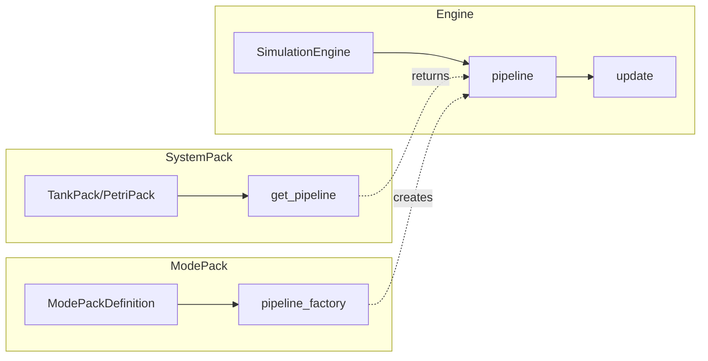

# Engine Pipeline Architecture

The Engine Pipeline is the pluggable abstraction that controls the simulation update loop. It enables different modes (Tank, Petri, Soccer, etc.) to customize the simulation behavior without modifying `SimulationEngine`.

## Overview



## Core Components

### PipelineStep

A single step in the update loop:

```python
@dataclass
class PipelineStep:
    name: str  # Human-readable identifier (e.g., "frame_start")
    fn: Callable[[SimulationEngine], None]  # Step execution function
```

### EnginePipeline

Ordered sequence of steps that define the update loop:

```python
class EnginePipeline:
    def __init__(self, steps: list[PipelineStep]): ...

    @property
    def step_names(self) -> list[str]: ...

    def run(self, engine: SimulationEngine) -> None:
        for step in self.steps:
            step.fn(engine)
```

### default_pipeline()

The canonical Tank pipeline that reproduces the exact phase order originally hard-coded in `SimulationEngine.update()`:

| Step | Phase | Description |
|------|-------|-------------|
| 1 | frame_start | Reset counters, increment frame |
| 2 | time_update | Advance day/night cycle |
| 3 | environment | Update ecosystem and detection modifiers |
| 4 | entity_act | Update all entities, collect spawns/deaths |
| 5 | lifecycle | Process deaths, add/remove entities |
| 6 | spawn | Auto-spawn food |
| 7 | collision | Handle physical collisions |
| 8 | interaction | Handle social interactions (poker) |
| 9 | reproduction | Handle mating and emergency spawns |
| 10 | frame_end | Update stats, rebuild caches |

## How ModePack Selects a Pipeline

1. **ModePackDefinition** can specify a `pipeline_factory: Callable[[], EnginePipeline] | None`
2. **SystemPack** implements `get_pipeline() -> EnginePipeline | None`
3. During `engine.setup()`, the engine calls `pack.get_pipeline()`
4. If the pack returns `None`, the engine uses `default_pipeline()`

```python
# In SimulationEngine.setup()
custom_pipeline = pack.get_pipeline() if hasattr(pack, "get_pipeline") else None
self.pipeline = custom_pipeline if custom_pipeline is not None else default_pipeline()
```

## Customizing the Pipeline

### Option 1: Override in SystemPack

```python
class MySoccerPack(SystemPack):
    def get_pipeline(self) -> EnginePipeline:
        return EnginePipeline([
            PipelineStep("frame_start", _step_frame_start),
            PipelineStep("physics", _step_physics),  # Custom step
            PipelineStep("ai_decision", _step_ai),   # Custom step
            PipelineStep("frame_end", _step_frame_end),
        ])
```

### Option 2: Via ModePackDefinition

```python
def create_my_mode_pack() -> ModePackDefinition:
    return ModePackDefinition(
        mode_id="my_mode",
        world_type="my_world",
        # ... other fields ...
        pipeline_factory=my_custom_pipeline,
    )
```

## Invariants

> [!IMPORTANT]
> **Tank default pipeline is canonical.** Other modes may override steps, but Tank's pipeline defines the reference behavior that all changes must maintain backward compatibility with.

- The default pipeline exactly reproduces the original `SimulationEngine.update()` behavior
- Tank mode returns `None` from `get_pipeline()` to use the default
- All existing `_phase_*` methods remain intact for potential reuse by custom pipelines

## Data Flow Between Steps

Some steps need to pass data to subsequent steps. This is handled via temporary engine attributes:

```python
def _step_time_update(engine):
    time_modifier, time_of_day = engine._phase_time_update()
    engine._pipeline_time_modifier = time_modifier
    engine._pipeline_time_of_day = time_of_day

def _step_entity_act(engine):
    time_modifier = getattr(engine, "_pipeline_time_modifier", 1.0)
    time_of_day = getattr(engine, "_pipeline_time_of_day", 0.5)
    # ... use values ...
```

## Related Files

- [`core/simulation/pipeline.py`](file:///Users/mike.bolaris/tank/core/simulation/pipeline.py) - Pipeline implementation
- [`core/simulation/engine.py`](file:///Users/mike.bolaris/tank/core/simulation/engine.py) - Engine integration
- [`core/modes/interfaces.py`](file:///Users/mike.bolaris/tank/core/modes/interfaces.py) - ModePack protocol
- [`core/worlds/system_pack.py`](file:///Users/mike.bolaris/tank/core/worlds/system_pack.py) - SystemPack protocol
